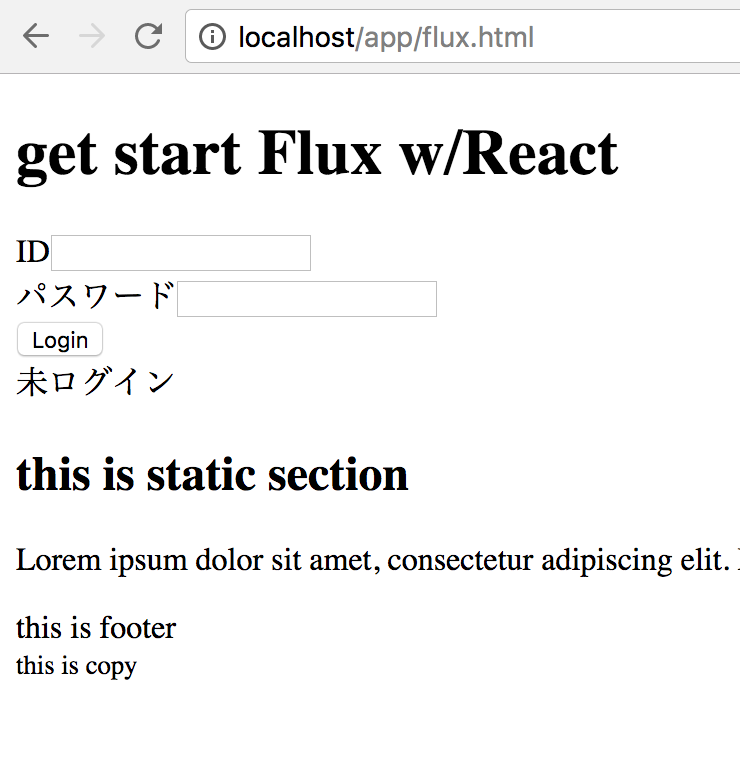

# Flux Hands On

#### 10分で実装するFlux
http://efcl.info/2015/04/24/react-meetup/

#### 仮想DOM
http://qiita.com/mizchi/items/4d25bc26def1719d52e6

#### React
- tutorial
https://facebook.github.io/react/tutorial/tutorial.html

- flux
https://facebook.github.io/flux/
https://facebook.github.io/flux/docs/overview.html

# how to build
/Users/setoguchi/IdeaProjects/flux/node_modules/gulp/bin/gulp.js browserify

# nignx 
## nginx.conf
```conf
worker_processes 1;


events {}

http {
    include mime.types;
    access_log    /var/log/nginx_access.log;
    error_log     /var/log/nginx_error.log  info;

    server {
        listen 80;
        server_name net-0.matsue-ct.ac.jp;
        index index.html index.htm;
        location  /  {
            root    /Users/setoguchi/IdeaProjects/flux;
        }
    }
}
```

### nginx command
```sh
# start
$ sudo nginx

# stop
$ sudo nginx -s stop

# reload
$ sudo nginx -s reload
```

### URL
http://localhost/app/flux.html




## next
### Redux
http://qiita.com/kiita312/items/49a1f03445b19cf407b7